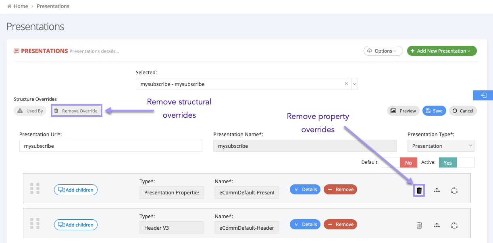

# Subscription Panel User Guide

## Welcome

Welcome to the Subscription Panel User Guide!

The Subscription Panel is an application that allows potential customers to purchase subscriptions. You can manage the look, feel, and content of the Subscription Panel in the CMS. Every detail is manageable, from what offers display to what colors are used. 

### Guide structure

This guide is composed of two main elements:

- Overview - gives a brief introduction to the various features covered in this guide
<!-- - Quick start - gives the quickest explanation for how to get started -->
- Tutorials - task-based guides for common Subscription Panel tasks

---------------------------------------

## Overview

The Subscription Panel features work in tandem with the CMS Hierarchy and Cache Management features. This section discusses both the CMS Hierarchy feature and Cache Management feature, as well as the Subscription Panel features. The Subscription Panel is comprised of three subsections:

* Component Manager
* Structure Admin
* Presentations

### Diagram

This diagram illustrates how the three features work in tandem. 

### CMS Hierarchy

#### Description

There are three levels in the CMS Hierarchy:

1. Client
2. Newspaper Group
3. Newspaper

Newspapers are a part of a Newspaper Group, and a Newspaper Group is a part of a Client. Settings can be applied at each level, but settings at the Client level act as the default and apply to lower levels as well. However, changes made at lower levels (e.g. Newspaper or Newspaper Group) will not automatically apply to higher levels. Lower level changes are called **overrides** since they override higher level settings.

> **Tip**: We suggest organizing the hierarchy by configuring widely used settings at the Client level, then overriding them at lower levels when necessary. In some cases, overriding is the best way to manage settings (e.g. overriding Attribute for different Newspapers) and doing so will save you headaches in the future.

#### Choose a hierarchy

You can navigate between the hierarchical levels. To do so:

1. Select the **hierarchy button**. (The button will display the current level's name.) After selecting the button, the CMS Hierarchy screen will appear.
2. Choose the level you wish to be on. The window will disappear. Any change you now make will apply to the selected and lower levels.

#### Overrides

There are two types of overrides for the Subscription Panel section of the CMS:

- structural overrides - these apply to changes in the structuring of different components (e.g. changing parent/child relationships or their location)
- property overrides - these apply to changes of a component's property (e.g. changing the color of a component)

Remove structural overrides with the **remove overrides** button and remove property overrides with the wastebin icon located next to the component in question.

-----------

### Cache management

#### Description

This feature clears your cache so that any changes you make take effect. You will want to use `CMS + Panel` button to clear the caches of the CMS and Subscription Panel feature.

> Warning! You must set the panel's URL for this feature to use this feature. From the CMS, select **Admin** -> **CMS Settings** and fill in the `PanelClearCacheUrl1` field with your panel's URL. The URL must not contain an SSL certificate (i.e. use `HTTP`, and do not use `HTTPS`).

If your cache was successfully cleared, a success banner appears at the bottom of the screen.

-----------

### Component manager overview

#### Description

The Component Manager subsection allows you to manage your Subscription Panel components. Components are the building blocks for your presentations. Each component has a name, class, and code. Components themselves contain various properties, which you can manage when you edit or create a component.

Each component is comprised of the following things:

- Name - The display name for the component
- Class - The overarching class the component falls into (e.g. address components or payment components)
- Code - The code used to call and refer to the component

> **Note**: Typically, Naviga developers create your components with an SQL script. This ensures that your components are correctly named and ordered. A component's class and code, for instance, must adhere to a predefined naming convention for them to function properly. So though you can create components manually, **it is not recommended**.

#### UI

The image below depicts the Component Manager UI.

If you select the **+ add new** button to create a new component, the following screen appears.

-----------

### Structure Admin overview

#### Description

The Structure Admin subsection allows you to _structure_ components to build a Presentation Template. Whereas components are just the building blocks of your presentation, a template is the _arraignment_ of the building blocks in a particular way.

Typically you will need only a single Presentation Template. It contains a Template Name and a Presentation Type, and is comprised of various components.

You can drag the components to arrange their order, or designate certain components as either a parent or child component.

> **Note**: Typically, Naviga developers create your Presentation Template. This ensures that it is created to spec. However, you can [create a Presentation Templates](example.com) manually.

#### UI

This image shows two components. One is a parent component and has multiple child components.

This image shows the component selector tool. Use it to drag components into your Presentation Template.

### Presentations overview

#### Description

The Presentations subsection allows you to manage the _presentation_ of your _arranged components_. Instead of creating or arranging components, you are creating, previewing, editing, or deleting the final presentation of all of your work. Similar to how you use various components to create a Presentation Template, you now fine tune your Presentation Template(s) to create various Presentations.

#### UI

You can either create a new presentation, import a presentation (JSON), or select an existing presentation.

When creating a new presentation:
- a **blank presentation** is a presentation with no components.
- **save selection as new** reuses the _same_ components for multiple presentations, which means changes at the component level will affect both/any presentations using these components.
- **duplicate selection** creates _copies_ of the components to use in a new presentation, which means changes at the component level will not affect other presentations.

> **Tip**: When either saving as new or duplicating components, you should rename them so as to avoid adding copy1, copy2, and so on as extensions. 

This image displays the various features of the Presentations menu:

After selecting/creating/importing a presentation, you can:

- preview your presentation (to preview, you must be on a Newspaper level with your CMS hierarchy.)
- set whether your presentation is **active/inactive**, which determines whether the presentation can be viewed by end-users
- set whether your presentation is a **default** presentation
- manage your various components

---------------------------------------

## Tutorials, how-tos, and reference documentation

This section of the guide contains tutorials, how-tos, and reference material for the Subscription Panel. Here you will find in depth information for working with the Subscription Panel. The following topics are covered:

- item 1
- item 2
- item 3
- so on and so forth

### Components matrix

The matrix below defines each component. Each tab represents a component class and has a table that describes the component and lists each possible parent and child components. Refer to this matrix for component definitions. 

> **Tip**: The intent of the matrix is to provide a comprehensive definition for all (is this every component?) components that you can reference for specific questions. We suggest using task-based tutorials to help with particular tasks.

> (MATRIX THAT IS IN GITBOOK)

-----------------

### Create, edit, and remove a property

#### Description

Each component must have at least one property, but typically a component has many properties.

#### Create a new property

To add a property to a component:

1. Select the **component manager** button from the CMS.
2. Search for the component that you wish to add a property to and select **edit**. (Optionally, select **+ add new** to create a new component.)
3. Select **+ add new property**. The property creation screen appears.
4. Fill in the property's information.
5. Select **save** in the property's edit column.

#### Edit an existing property

To edit a component's properties:

1. Select the **component manager** button from the CMS.
2. Search for the component that you wish to edit.
3. Select the **edit** button corresponding with your desired component. The property manager will display below.
4. Navigate to the desired property and perform your desired edits.
5. Select either **save** or **save as new**.

#### Remove a property

To remove a property from a component:

1. Select the **component manager** button from the CMS.
2. Search for the component that you wish to remove a property from.
3. Select the **edit** button corresponding with your desired component. The property manager will display below.
4. Find the desired property you wish to remove from the list and select **delete**.

-----------------

### Create, edit, and delete a Presentation Template

You can only edit Presentation Templates at the `Client` hierarchical level. 

To create a new Presentation Template:

1. From the CMS, select the **hierarchy** button and choose the `Client` level.
2. Select **Subscription Panel**, then choose **Structure Admin**.
3. Select **+ add new template**. The template creation screen appears.
4. Choose a Template Name and Presentation Type. **Note**: each Presentation Type has a unique tree structure. If you change the Presentation Type after having made some edits, _the new tree structure will delete the existing tree structure and you will lose your edits._

To edit a Presentation Template:

1. From the CMS, select the **hierarchy** button and choose the `Client` level.
2. Select **Subscription Panel**, then choose **Structure Admin**.
3. Select an existing Presentation Template from the **selected** drop-down menu.
4. Perform any edits you with to make, then select **save**.

To duplicate a Presentation Template:

1. From the CMS, select the **hierarchy** button and choose the `Client` level.
2. Select **Subscription Panel**, then choose **Structure Admin**.
3. Select an existing Presentation Template from the **selected** drop-down menu.
4. Select the **duplicate** button. The duplicated Presentation Template will appear in the drop-down menu. Select it to change it's name.

To delete a Presentation Template:

1. From the CMS, select the **hierarchy** button and choose the `Client` level.
2. Select **Subscription Panel**, then choose **Structure Admin**.
3. Select an existing Presentation Template from the **selected** drop-down menu.
4. Select the **- delete** button. Confirm you wish to delete this Presentation Template and select **Yes**. The template will be removed from the drop-down menu.

-----------------

### Create or import Presentations

You can either create a new presentation or import a presentation from a JSON file.

#### Import a Presentation

To import a Presentation:

1. From the CMS, select the **hierarchy** button and choose a hierarchical level (`Client`, `Newspaper Group`, or `Newspaper`).
2. Select **Subscription Panel**, then choose **Presentations**.
3. Select the **options** drop-down and choose **import**.
4. **Select a file** then select **import**.

If successful, your new presentation should appear under the presentations drop-down menu.

#### Create a Presentation

##### Prerequisites

Each new Presentation should meet the following criteria:

* Have a unique Presentation Name (cannot be blank) that contains only digits and latin letters
* Have a unique Presentation URL
* Have a Presentation Type
* Contain valid parent-child relationships between components.
* Contain the following components:
  1. Presentation Properties
  2. Header
  3. Page
  4. Step
  5. Confirmation
  6. Order Summary

##### Typical Presentation Component Layout

(PRESENTATION LAYOUT DIAGRAM)

##### Procedure

To create a new Presentation:

1. From the CMS, select the **hierarchy** button and choose a hierarchical level (`Client`, `Newspaper Group`, or `Newspaper`).
2. Select **Subscription Panel**, then choose **Presentations**.
3. Select **add new presentation** and choose an option:
    
    A _blank presentation_ contains no components.
    
    _Save section as new_ reuses components. Changes made to components in this presentation will affect other presentations using these components.
    
    _Duplicate selection_ makes copies of the components for this presentation. Changes made to components in this presentation **will not** affect other presentations.

    **Note**: if either saving as new or duplicating, select a presentation to work from the drop-down menu first, then choose your option.
4. Based on your selection, continue to the corresponding section below for further steps.

**Blank Presentations**:

1. Add a presentation URL, presentation name, and presentation type to your new presentation.
2. Choose whether you want the presentation to be a default presentation and whether its status is active/inactive.
3. Use the **component selector** sidebar to add your components.
4. Select **save**.

**Save Section as new**:

1. Change the presentation's name and URL to something unique.
2. (Optionally, rename the components using the Component Renaming Tool. Once finished, select **save and close**. If you don't want to rename the components, select the **x** to exit from the tool).
3. Select **save** to finish.

**Duplicate section**:

1. Change the Presentation's name and URL so that they are unique, then select **ok**.
2. (Optionally, rename the components using the Component Renaming Tool. Once finished, select **save and close**. If you don't want to rename the components, select the **x** to exit from the tool.)
3. Select **save** to finish.

-----------------

### Preview a Presentation

You can preview a Presentation at any time with the **preview** button.

To preview a Presentation:

1. From the CMS, select the **hierarchy** button and choose an option from the `Newspaper` level.
2. Select **Subscription Panel**, then choose **Presentations**.
3. Select the desired Presentation you wish to preview from the **selected** drop-down menu. Greyed Presentations are ...
4. Select the **preview** button. A preview window will appear. If you've recently made changes, clear your cache first. Select **Manage Cache** then **Refresh CMS + Site**.

-----------------

### Edit, delete, or export a Presentation

You can edit and delete Presentations.

#### Edit

To edit a Presentation:

1. From the CMS, select the **hierarchy** button and choose a hierarchical level (`Client`, `Newspaper Group`, or `Newspaper`).
2. Select **Subscription Panel**, then choose **Presentations**.
3. Select the desired Presentation you wish to edit from the **selected** drop-down menu. Greyed Presentations are ...
4. Make your desired changes to the Presentation. To add a component, drag them from the **Component Selector** sidebar. To remove a component, select the **- remove** button next to the desired component.
5. Select **save** once finished.

#### Undo a change

If at any time you've made a mistake that you wish to undo, select the **cancel** button. Any changes will be removed and the Presentation screen will disappear.

#### Delete

When you delete a Presentation you **are not** deleting components. They will still be available in the Component Manager section. 

To delete a Presentation:

1. From the CMS, select the **hierarchy** button and choose the `Client` hierarchical level.
2. Select **Subscription Panel**, then choose **Presentations**.
3. Select the desired Presentation you wish to delete from the **selected** drop-down menu. Greyed Presentations are ...
4. Select **- delete**. Confirm this is the correct Presentation and select **Yes**.

#### Export

You can export Presentations as either a JSON or HTML file.

To export a Presentation as JSON:

1. From the CMS, select the **hierarchy** button and choose a level (`Client`, `Newspaper Group`, or `Newspaper`).
2. Select **Subscription Panel**, then choose **Presentations**.
3. Select the **options** drop-down, then choose **export**.
4. Select which Presentation(s) you want to export. The **show advanced** button allows you to include entity, property, and dictionary types as well as structure templates into the JSON file.
5. Select **export content**. The download dialogue will appear. **Note**: if you chose many Presentations or the Presentation is large, it may take longer for the dialogue to appear.

To export a Presentation as HTML:

1. From the CMS, select the **hierarchy** button and choose a level (`Client`, `Newspaper Group`, or `Newspaper`).
2. Select **Subscription Panel**, then choose **Presentations**.
3. Select the Presentation you wish to export from the **selected** drop-down menu.
4. Select the **options** drop-down, then choose **Business export**. The download dialogue will appear.