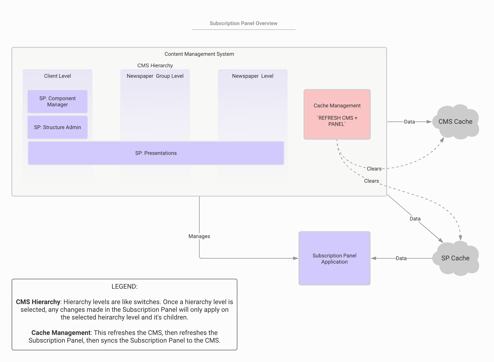

# Subscription Panel User Guide

## Welcome

Welcome to the Subscription Panel User Guide!

The Subscription Panel is an application that allows potential customers to purchase subscriptions. You can manage the look, feel, and content of the Subscription Panel in the CMS. Every detail is manageable, from what offers display to what colors are used. 

### Guide structure

This guide is composed of two main elements:

- Overview - gives a brief introduction to the various features covered in this guide
<!-- - Quick start - gives the quickest explanation for how to get started -->
- Tutorials - task-based guides for common Subscription Panel tasks

---------------------------------------

## Overview

The Subscription Panel features work in tandem with the CMS Hierarchy and Cache Management features. This section discusses both the CMS Hierarchy feature and Cache Management feature, as well as the Subscription Panel features. The Subscription Panel is comprised of three subsections:

* Component Manager
* Structure Admin
* Presentations

### Diagram

This diagram illustrates how the three features work in tandem. 

### CMS Hierarchy

#### Description

There are three levels in the CMS Hierarchy:

1. Client
2. Newspaper Group
3. Newspaper

Newspapers are a part of a Newspaper Group, and a Newspaper Group is a part of a Client. Settings can be applied at each level, but settings at the Client level act as the default and apply to lower levels as well. However, changes made at lower levels (e.g. Newspaper or Newspaper Group) will not automatically apply to higher levels. Lower level changes are called **overrides** since they override higher level settings.

> **Tip**: We suggest organizing the hierarchy by configuring widely used settings at the Client level, then overriding them at lower levels when necessary. In some cases, overriding is the best way to manage settings (e.g. overriding Attribute for different Newspapers) and doing so will save you headaches in the future.

#### Choose a hierarchy

You can navigate between the hierarchical levels. To do so:

1. Select the **hierarchy button**. (The button will display the current level's name.) After selecting the button, the CMS Hierarchy screen will appear.
2. Choose the level you wish to be on. The window will disappear. Any change you now make will apply to the selected and lower levels.

#### Overrides

There are two types of overrides for the Subscription Panel section of the CMS:

- structural overrides - these apply to changes in the structuring of different components (e.g. changing parent/child relationships or their location)
- property overrides - these apply to changes of a component's property (e.g. changing the color of a component)

Remove structural overrides with the **remove overrides** button and remove property overrides with the wastebin icon located next to the component in question.

-----------

### Cache management

#### Description

This feature clears your cache so that any changes you make take effect. You will want to use `CMS + Panel` button to clear the caches of the CMS and Subscription Panel feature.

> Warning! You must set the panel's URL for this feature to use this feature. From the CMS, select **Admin** -> **CMS Settings** and fill in the `PanelClearCacheUrl1` field with your panel's URL. The URL must not contain an SSL certificate (i.e. use `HTTP`, and do not use `HTTPS`).
> **Example**: http://checkout-demo.subscriberconcierge.com/cache/refresh

If your cache was successfully cleared, a success banner appears at the bottom of the screen.

-----------

### Component manager overview

#### Description

The Component Manager subsection allows you to manage your Subscription Panel components. Components are the building blocks for your presentations. Each component has a name, class, and code. Components themselves contain various properties, which you can manage when you edit or create a component.

Each component is comprised of the following things:

- Name - The display name for the component
- Class - The overarching class the component falls into (e.g. address components or payment components)
- Code - The code used to call and refer to the component

> **Note**: Typically, Naviga developers create your components with an SQL script. This ensures that your components are correctly named and ordered. A component's class and code, for instance, must adhere to a predefined naming convention for them to function properly. So though you can create components manually, **it is not recommended**.

#### UI

The image below depicts the Component Manager UI.

If you select the **+ add new** button to create a new component, the following screen appears.

-----------

### Structure Admin overview

#### Description

The Structure Admin subsection allows you to _structure_ components to build a Presentation Template. Whereas components are just the building blocks of your presentation, a template is the _arraignment_ of the building blocks in a particular way.

Typically you will need only a single Presentation Template. It contains a Template Name and a Presentation Type, and is comprised of various components.

You can drag the components to arrange their order, or designate certain components as either a parent or child component.

> **Note**: Typically, Naviga developers create your Presentation Template. This ensures that it is created to spec. However, you can [create a Presentation Templates](example.com) manually.

#### UI

This image shows two components. One is a parent component and has multiple child components.

This image shows the component selector tool. Use it to drag components into your Presentation Template.

### Presentations overview

#### Description

The Presentations subsection allows you to manage the _presentation_ of your _arranged components_. Instead of creating or arranging components, you are creating, previewing, editing, or deleting the final presentation of all of your work. Similar to how you use various components to create a Presentation Template, you now fine tune your Presentation Template(s) to create various Presentations.

#### UI

You can either create a new presentation, import a presentation (JSON), or select an existing presentation.

When creating a new presentation:
- a **blank presentation** is a presentation with no components.
- **save selection as new** reuses the _same_ components for multiple presentations, which means changes at the component level will affect both/any presentations using these components.
- **duplicate selection** creates _copies_ of the components to use in a new presentation, which means changes at the component level will not affect other presentations.

> **Tip**: When either saving as new or duplicating components, you should rename them so as to avoid adding copy1, copy2, and so on as extensions. 

This image displays the various features of the Presentations menu:

After selecting/creating/importing a presentation, you can:

- preview your presentation (to preview, you must be on a Newspaper level with your CMS hierarchy.)
- set whether your presentation is **active/inactive**, which determines whether the presentation can be viewed by end-users
- set whether your presentation is a **default** presentation
- manage your various components

---------------------------------------

## Tutorials, how-tos, and reference documentation

This section of the guide contains tutorials, how-tos, and reference material for the Subscription Panel. Here you will find in depth information for working with the Subscription Panel. This section covers the following topics:

- Component matrix
- Create, edit, or remove component properties
- Create, edit, or delete a Presentation Template
- Create or import Presentations
- Preview a Presentation
- Create, edit, or delete Presentations

### Components matrix

The matrix below defines each component. Each tab represents a component class and has a table that describes the component and lists each possible parent and child components. Refer to this matrix for component definitions. 

> **Tip**: The intent of the matrix is to provide a comprehensive definition for supported components that you can reference for specific questions. We suggest using task-based tutorials to help with particular tasks.

> (MATRIX THAT IS IN GITBOOK)

-----------------

### Create, edit, or remove component properties

#### Description

Each component must have at least one property, but typically a component has many properties.

> **Note**: Though it is possible to create properties, and there are instructions to do so below, we highly recommend that you don't. Naviga is happy to create them for you, and usually does with a script. This ensures they function properly.

#### Create a new property

To add a property to a component:

1. From the CMS, select the **Hierarchy** button and chose the `Client` level. Properties can only be created at this level.
2. Select the **Component Manager** button.
3. Search for the component that you wish to add a property to and select **Edit**. (Optionally, select **+ Add New** to create a new component.)
4. Select **+ Add New Property**. The property creation screen appears.
5. Fill in the property's information.
6. Select **Save** in the property's edit column.

#### Edit an existing property

To edit a component's properties:

1. From the CMS, select the **Hierarchy** button and chose the `Client` level. Properties can only be edited at this level.
2. Select the **Component Manager** button.
3. Search for the component that you wish to edit.
4. Select the **Edit** button corresponding with your desired component. The property manager will display below.
5. Navigate to the desired property and perform your desired edits.
6. Select either **Save** or **Save as New**.

#### Remove a property

To remove a property from a component:

1. From the CMS, select the **Hierarchy** button and chose the `Client` level. Properties can only be edited at this level.
2. Select the **Component Manager** button.
3. Search for the component that you wish to remove a property from.
4. Select the **Edit** button corresponding with your desired component. The property manager will display below.
5. Find the desired property you wish to remove from the list and select **Delete**.

-----------------

### Create, edit, or delete a Structure Admin Presentation Template

You can only edit Presentation Templates at the `Client` hierarchical level.

> **Note**: Though it is possible to create Presentation Templates, and there are instructions to do so below, we highly recommend that you don't. Naviga is happy to create them for you, and usually does with a script. This ensures they function properly.

To create a new Presentation Template:

1. From the CMS, select the **Hierarchy** button and choose the `Client` level.
2. Select **Subscription Panel**, then choose **Structure Admin**.
3. Select **+ Add New Template**. The template creation screen appears.
4. Choose a Template Name and Presentation Type. **Note**: each Presentation Type has a unique tree structure. If you change the Presentation Type after having made some edits, _the new tree structure will delete the existing tree structure and you will lose your edits._

To edit a Presentation Template:

1. From the CMS, select the **Hierarchy** button and choose the `Client` level.
2. Select **Subscription Panel**, then choose **Structure Admin**.
3. Select an existing Presentation Template from the **Selected** drop-down menu.
4. Perform any edits you with to make, then select **Save**. Typically, edits at this stage will be the inclusion of various components. View the [tutorials section]() for more information.

To duplicate a Presentation Template:

1. From the CMS, select the **Hierarchy** button and choose the `Client` level.
2. Select **Subscription Panel**, then choose **Structure Admin**.
3. Select an existing Presentation Template from the **Selected** drop-down menu.
4. Select the **Duplicate** button. The duplicated Presentation Template will appear in the drop-down menu. Select it to change it's name.

To delete a Presentation Template:

1. From the CMS, select the **Hierarchy** button and choose the `Client` level.
2. Select **Subscription Panel**, then choose **Structure Admin**.
3. Select an existing Presentation Template from the **Selected** drop-down menu.
4. Select the **- Delete** button. Confirm you wish to delete this Presentation Template and select **Yes**. The template will be removed from the drop-down menu.

-----------------

### Create or import Presentations

You can either create a new presentation or import a presentation from a JSON file.

#### Import a Presentation

To import a Presentation:

1. From the CMS, select the **Hierarchy** button and choose a hierarchical level (`Client`, `Newspaper Group`, or `Newspaper`).
2. Select **Subscription Panel**, then choose **Presentations**.
3. Select the **Options** drop-down and choose **Import**.
4. **Select a file** then select **Import**.

If successful, your new presentation should appear under the presentations drop-down menu.

#### Create a Presentation

##### Prerequisites

Each new Presentation should meet the following criteria:

* Have a unique Presentation Name (cannot be blank) that contains only digits and latin letters
* Have a unique Presentation URL
* Have a Presentation Type
* Contain valid parent-child relationships between components.
* Contain the following components:
  1. Presentation Properties
  2. Header
  3. Page
  4. Step
  5. Confirmation
  6. Order Summary

##### Typical Presentation Component Layout

(PRESENTATION LAYOUT DIAGRAM)

##### Procedure

To create a new Presentation:

1. From the CMS, select the **Hierarchy** button and choose a hierarchical level (`Client`, `Newspaper Group`, or `Newspaper`).
2. Select **Subscription Panel**, then choose **Presentations**.
3. Select **add new presentation** and choose an option:
    
    A _blank presentation_ contains no components.
    
    _Save section as new_ reuses components. Changes made to components in this presentation will affect other presentations using these components.
    
    _Duplicate selection_ makes copies of the components for this presentation. Changes made to components in this presentation **will not** affect other presentations.

    **Note**: if either saving as new or duplicating, select a presentation to work from the drop-down menu first, then choose your option.
4. Based on your selection, continue to the corresponding section below for further steps.

**Blank Presentations**:

1. Add a presentation URL, presentation name, and presentation type to your new presentation.
2. Choose whether you want the presentation to be a default presentation and whether its status is active/inactive.
3. Use the **component selector** sidebar to add your components.
4. Select **Save**.

**Save Section as new**:

1. Change the presentation's name and URL to something unique.
2. (Optionally, rename the components using the Component Renaming Tool. Once finished, select **save and close**. If you don't want to rename the components, select the **x** to exit from the tool).
3. Select **Save** to finish.

**Duplicate section**:

1. Change the Presentation's name and URL so that they are unique, then select **ok**.
2. (Optionally, rename the components using the Component Renaming Tool. Once finished, select **save and close**. If you don't want to rename the components, select the **x** to exit from the tool.)
3. Select **Save** to finish.

-----------------

### Preview a Presentation

You can preview a Presentation at any time with the **Preview** button.

To preview a Presentation:

1. From the CMS, select the **Hierarchy** button and choose an option from the `Newspaper` level.
2. Select **Subscription Panel**, then choose **Presentations**.
3. Select the desired Presentation you wish to preview from the **Selected** drop-down menu. Greyed Presentations are inactive.
4. Select the **Preview** button. A preview window will appear. If you've recently made changes, clear your cache first. Select **Manage Cache** then **Refresh CMS + Panel**.

-----------------

### Edit, delete, or export Presentations

You can edit and delete Presentations.

#### Edit

To edit a Presentation:

1. From the CMS, select the **Hierarchy** button and choose a hierarchical level (`Client`, `Newspaper Group`, or `Newspaper`).
2. Select **Subscription Panel**, then choose **Presentations**.
3. Select the desired Presentation you wish to edit from the **Selected** drop-down menu. Greyed Presentations are inactive.
4. Make your desired changes to the Presentation. To add a component, drag them from the **Component Selector** sidebar. To remove a component, select the **- remove** button next to the desired component.
5. Select **Save** once finished.

#### Undo a change

If at any time you've made a mistake that you wish to undo, select the **cancel** button. Any changes will be removed and the Presentation screen will disappear.

#### Delete

When you delete a Presentation you **are not** deleting components. They will still be available in the Component Manager section.

To delete a Presentation:

1. From the CMS, select the **Hierarchy** button and choose the `Client` hierarchical level.
2. Select **Subscription Panel**, then choose **Presentations**.
3. Select the desired Presentation you wish to delete from the **Selected** drop-down menu. Greyed Presentations are inactive.
4. Select **- delete**. Confirm this is the correct Presentation and select **Yes**.

#### Export

You can export Presentations as either a JSON or HTML file.

To export a Presentation as JSON:

1. From the CMS, select the **Hierarchy** button and choose a level (`Client`, `Newspaper Group`, or `Newspaper`).
2. Select **Subscription Panel**, then choose **Presentations**.
3. Select the **Options** drop-down, then choose **export**.
4. Select which Presentation(s) you want to export. The **show advanced** button allows you to include entity, property, and dictionary types as well as structure templates into the JSON file.
5. Select **export content**. The download dialogue will appear. **Note**: if you chose many Presentations or the Presentation is large, it may take longer for the dialogue to appear.

To export a Presentation as HTML:

1. From the CMS, select the **Hierarchy** button and choose a level (`Client`, `Newspaper Group`, or `Newspaper`).
2. Select **Subscription Panel**, then choose **Presentations**.
3. Select the Presentation you wish to export from the **Selected** drop-down menu.
4. Select the **Options** drop-down, then choose **Business export**. The download dialogue will appear.

-----------------

### Add a landing to a Presentation

#### Overview

A landing page hosts desired Offer Groups that you want potential subscribers to see immediately.  

To add a landing to your Presentation, make a landing component (e.g. `Landing - Tiles V3`, `Landing - Tab V3`, etc.) the child of the `Page V3` component, then add any desired promotion components as children of the landing component. Which ever promotions components you choose will appear on the landing page.

#### Step-by-step guide

Arrange the components:

1. From the CMS, select the **Hierarchy** button and choose a level (`Client`, `Newspaper Group`, or `Newspaper`).
2. Select **Subscription Panel**, then choose **Presentations**.
3. From the drop-down menu, select the Presentation you wish to add a landing. The Presentation's structure and components will appear below.
4. [Add](link to how to add new components) or drag your desired landing component into the Presentation and make it a child to the `Page V3` component.
5. Expand the landing component to display it's children, then add promotion components as children (e.g. `Promotion Digital V3`, `Promotion ZipCode V3`, etc).

Next, configure the promotion component's properties. Select the **Details** button to expand the component's properties.

At minimum, the component needs a name. However, we suggest you configure the following properties for `Promotion Digital V3` :

- `Title` - the title that displays above the promotion.
- `Body` - the text that displays in the promotion's body.
- `Image` - the image in the promotion's body.
- `Button text` - the text displayed in the button.
- `Button OfferGroupId` - add the promotion's Offer Group ID to this property. This links this promotion component to the promotion in the circulation database.

And for `Promotion ZipCode V3`:

- `Title` - the title that displays above the promotion
- `Body` - the text that displays in the promotion's body.
- `Image` - the image in the promotion's body.
- `Button text` - the text that displays in the button.
- `Button offer groupId` - add the promotion's Offer Group ID to this property. This links the promotion component to the promotion in the circulation database.
- `NoOffersAvailableMessage` - add a message to this property. This displays a message to users when there are no offers available to them (usually because of location).

-----------------

### Add social media icons at the confirmation screen

#### Overview

You can add social media icons to your confirmation screen. Each social media element has it's own component. Each `Social Media V3` component must be a child of the `Confirmation V3` component, which is a child of the `Page V3` component.

#### Before you start

Before you follow the steps below, be sure that the `Confirmation V3` component is a child of the `Page V3` component.

#### Step-by-step guide

Arrange the components:

1. From the CMS, select the **Hierarchy** button and choose a level (`Client`, `Newspaper Group`, or `Newspaper`).
2. Select **Subscription Panel**, then choose **Presentations**.
3. From the drop-down menu, select the Presentation you wish to add social media components to. The Presentation's structure and components will appear below.
4. Drag a `Social Media V3` component into the Presentation and make it a child to the `Confirmation V3` component.
    **Note**: Each social media icon requires it's own component. For instance, if you want icons for Facebook, Twitter, and LinkedIn, you will need three social media components.

5. Select **Save**.

Configure various component properties: 

1. Navigate to the social media components.
2. Expand each social media component and fill out the `SocialMedia Link` `SocialMedia Type` properties. **Example**: For Twitter, enter `www.twitter.com` for the link and select `Twitter` from the `type` drop-down menu.
3. (Optionally, configure the `SocialMedia Header` [e.g. "Follow us on"].)
4. Select **Save**.

-----------------

### Add app-download buttons to the confirmation screen

#### Overview

You can add app-download buttons to the confirmation screen. Currently we support buttons for the Apple App Store and the Google Play Store. Each app store button needs its own `App Downloads V3` component, which must be a child of the `Confirmation V3` component.

#### Before you start

Before you follow the steps below, be sure that the `Confirmation V3` component is a child of the `Page V3` component.

#### Step-by-step guide

Arrange the components:

1. From the CMS, select the **Hierarchy** button and choose a level (`Client`, `Newspaper Group`, or `Newspaper`).
2. Select **Subscription Panel**, then choose **Presentations**.
3. From the drop-down menu, select the Presentation you wish to add download buttons to. The Presentation's structure and components will appear below.
4. Drag a `App Downloads V3` component into the Presentation and make it a child to the `Confirmation V3` component.
    **Note**: Each app store icon it's own component. For instance, if your app is in both the Apple App Store and the Google Play Store, you will need two components.
5. Select the **Details** button next to each component, and add the corresponding `AppDownloads Link` (e.g. www.google.com).
6. Select **Save** next to each component to save your work.

Configure various component properties:

1. Navigate to the `Confirmation V3` component that is the parent to your `App Downloads V3` components.
2. Select the **Details** button to expand the component's properties.
3. Toggle `AppDownloads.Show` to `ON`.
4. (Optionally, configure the `AppDownloads Header` [e.g. "Download our apps].)
5. Select **Save**.

Other non-mandatory properties:

* `AppDownloads.Subtitle` - Subtitle to the header
* `AppDownloads.Image` - adds a background image
* `AppDownloads.Styling.Background` - changes the background color

-----------------

### Configure an upsell offer

#### Overview
An Upsell Offer is a more expensive offer that you can present to your customers. You can  add upsell offers to your Presentation by adding the `Upsell V3` component as a child to a `Step V3` component. Typically, the `Upsell V3` component is added to the second `Step V3` component of the third `Page V3` component .

#### Before you start

Before you continue to the tutorial steps below, be sure to have added the corresponding Upsell Offer in Solicitor Concierge.

#### Step-by-step guide

Arrange the components:

1. From the CMS, select the **Hierarchy** button and choose a level (`Client`, `Newspaper Group`, or `Newspaper`).
2. Select **Subscription Panel**, then choose **Presentations**.
3. From the drop-down menu, select the Presentation you wish to add an upsell feature to. The Presentation's structure and components will appear below.
4. Drag the `Upsell V3` component into your Presentation and make it a child to any `Step V3` component.
5. Select **Save**.

Configure various component properties:

1. Navigate to the `Upsell V3` component and select the **Details** button.
2. Toggle `Offer ShowImage` to `On`.
3. Toggle `Offer MarketingTitle Show` to `On` and add text to the `InlineTitle` and `Offer MarketingTitle Text` properties.
4. Select **Save**.

> **Note**: These are the recommended properties to make your component functional. Fill in the other properties to add more customization. These are the recommended properties to make your component functional. Fill in the other properties to add more customization. If you'd prefer your Upsell to appear as a modal, toggle the `showinModal` to `On`.

### Ask for registration password only at confirmation

#### Overview

You can arrange your Subscription Panel to ask for a user's registration password _after_ they've finished purchasing, at the confirmation screen. The component checks the user's email to see if it has already been registered, and if it has not, it will prompt for a registration password.

This often leads to more customer retention, and makes the checkout process efficient. Todo this, the `Registration on Confirmation V3` component needs to be a child of the `Confirmation V3` component. Follow the instructions below for a step-by-step guide.

#### Step-by-step guide

Arrange the components:

1. From the CMS, select the **Hierarchy** button and choose a level (`Client`, `Newspaper Group`, or `Newspaper`).
2. Select **Subscription Panel**, then choose **Presentations**.
3. From the drop-down menu, select the Presentation you wish to edit. The Presentation's structure and components will appear below.
4. Using the Component Selector tool, drag the `Registration on Confirmation V3` component into your Presentation and make it a child to any `Confirmation V3` component.
5. Select **Save**.

Configure various component properties:

1. Navigate to the `Registration on Confirmation V3` component and select the **Details** button.
2. Toggle `Password Show` to `On`.
3. Toggle `Password Validation Required Apply` to `On`.
4. Add text to the `Title` property (e.g. "Create a password") and `Button Text` property (e.g. "Submit").
5. Select **Save**.

### Add an abandonment popover

#### Overview

An abandonment popover is a popover that appears whenever a user moves their pointer near the top of the screen, presumably to abandon the page. The popover usually contains an offer at a discounted price, though you can customize the popover to contain any offer.

To add this popover to your presentation, add the `AbandonmentPopoverV3` component as a child to the `Page V3` component. Follow the step-by-step guide below for more instructions.

#### Step-by-step guide

Arrange the components:

1. From the CMS, select the **Hierarchy** button and choose a level (`Client`, `Newspaper Group`, or `Newspaper`).
2. Select **Subscription Panel**, then choose **Presentations**.
3. From the drop-down menu, select the Presentation you wish to edit. The Presentation's structure and components will appear below.
4. Using the Component Selector tool, drag the `AbandonmentPopoverV3` component into your Presentation and make it a child to any `Page V3` component.
5. Select **Save**.

Configure various component properties:

1. Navigate to the `AbandonmentPopoverV3` component and select the **Details** button.
2. Toggle `Button Show` to `On`.
3. Add the offer id of the offer you wish to sell to the `Button OfferGroupId` field. This links the button to your offer in circulation.
4. Add text to the `title` and `body` properties (e.g. "Get Unlimited Access to Local News");
5. Add text to the `Button Text` property (e.g. "Get this Offer").
6. Set the `MaxWidth(px)` property to determine the pixel size of your popover. 1000 pixels is the madwidth.
7. Select **Save**.

> **Note**: These are the recommended properties we suggest to get going for a functional abandonment popover. Optionally, configure the `BackgroundColor`,`BackgroundImage`, or other properties.

### Add an idle popover

#### Overview

You can add an idle popover to your Subscription Panel that triggers a reminder (max width: 1000 pixels) when the user's mouse has been idle for a predefined amount of time. 

To add this popover to your presentation, add the `Idle Popover V3` component as a child to the `Page V3` component. Follow the step-by-step guide below for more instructions.

#### Step-by-step guide

Arrange the components:

1. From the CMS, select the **Hierarchy** button and choose a level (`Client`, `Newspaper Group`, or `Newspaper`).
2. Select **Subscription Panel**, then choose **Presentations**.
3. From the drop-down menu, select the Presentation you wish to edit. The Presentation's structure and components will appear below.
4. Using the Component Selector tool, drag the `Idle Popover V3` component into your Presentation and make it a child to any `Page V3` component.
5. Select **Save**.

Configure various component properties:

1. Navigate to the `Idle Popover V3` component and select the **Details** button.
2. Add text to the `title` and `body` properties.
3. Add a number of seconds `Idle Timeout (sec)` property. This number determines how many seconds go by before the popover appears.
4. Add a number to the `NumberOfOpenings` property. This number determines how many times the idle popover appears before it stops altogether.
5. Select **Save**.

> **Note**: These are the recommended properties we suggest to get going for a functional idle popover. Optionally, configure the `BackgroundColor`,`BackgroundImage`, `BorderColor`, and `BorderWidth` properties.

### Add a cookie banner to your Presentation

#### Overview

You can add a cookie notice banner to your Presentation that notifies users that the site stores third party cookies.

To add the cookie notice popover, you must add the `Cookie Notice V3` component as a child to the `Page V3` component. Follow the step-by-step guide below for more instructions.

#### Step-by-step guide

Arrange the components:

1. From the CMS, select the **Hierarchy** button and choose a level (`Client`, `Newspaper Group`, or `Newspaper`).
2. Select **Subscription Panel**, then choose **Presentations**.
3. From the drop-down menu, select the Presentation you wish to edit. The Presentation's structure and components will appear below.
4. Using the Component Selector tool, drag the `Cookie Notice V3` component into your Presentation and make it a child to any `Page V3` component.
5. Select **Save**.

Configure various component properties:

1. Navigate to the `Cookie Notice V3` component and select the **Details** button.
2. Enter values for the following property fields:
    `CookieText` - The text that appears on the banner, typically explaining that by continuing the user agrees to the cookies.
    `CookieLink` - A link typically to your privacy policy.
    `CookieLinkText` - The text of your link.
3. (Optionally, enter values for the following property fields:
    `Styling BackgroundColor` - a hexadecimal field and palette for the banner color. If not used, the default color will be used.
    `Styling TextColor` - a hexadecimal field palette for the text color.)
4. Select **Save**.

**Note**: When a user visits the page, the page will check to see if Subscribe's internal cookie with a value of `TRUE` already exists. If it does, nothing will happen. If it does not, a cookie banner will display. When the user closes the banner, a cookie will be set with a value of `TRUE` and an expiration date of 120 days.
------------

### Redirect mobile devices to a different Presentation

#### Overview

You can redirect mobile devices to different Presentations. This is helpful for ensuring that mobile users have the best Presentation possible.

#### Before you start

Before you follow the steps below, be sure to create a [mobile presentation](guide for mobile presentation).

#### Step-by-step guide

**To redirect mobile devices to a different Presentation**:

1. From the CMS, select the **Hierarchy** button and choose a level (`Client`, `Newspaper Group`, or `Newspaper`).
2. Select **Subscription Panel**, then choose **Presentations**.
3. From the drop-down menu, select the Presentation you wish to edit. The Presentation's structure and components will appear below.
4. Navigate to the `Presentation Properties V3` component and select the **Details** button.
5. Ensure the `DetectMobileDevices` property is set to `On`.
6. Add the mobile presentation's URL to the `MobileRedirectUrl` property.
7. Select **Save**.

------------

### Add OG tags to a Presentation

#### Overview

Open Graph Meta Tags (OG tags) control how URLs are displayed when shared on social media. To create an OG tag, you need to configure just a few properties of the `Presentation Properties V3` component. 

#### Step-by-step guide

**To add OG tags**:

1. From the CMS, select the **Hierarchy** button and choose a level (`Client`, `Newspaper Group`, or `Newspaper`).
2. Select **Subscription Panel**, then choose **Presentations**.
3. From the drop-down menu, select the Presentation you wish to edit. The Presentation's structure and components will appear below.
4. Navigate to the `Presentation Properties V3` component and select the **Details** button.
5. Ensure the following properties are configured:
    - `OgTags Description` - the description that displays when your page is shared.
    - `OgTags Image` - the image that displays when your page is shared.
    - `OgTags SiteName` - the website name that displays when your page is shared.
    - `OgTags Title` - the title that displays when your page is shared.
6. Select **Save**.

----------

### Enable CAPTCHA/ReCAPTCHA for a Presentation

#### Overview

You can enable CAPTCHA and ReCAPTCHA on a Presentation, as well as set a ReCAPTCHA score. To configure the score, configure a few properties of the `Presentation Properties V3` component.

#### Step-by-step guide

**To set the ReCAPTCHA score**:

1. From the CMS, select the **Hierarchy** button and choose a level (`Client`, `Newspaper Group`, or `Newspaper`).
2. Select **Subscription Panel**, then choose **Presentations**.
3. From the drop-down menu, select the Presentation you wish to edit. The Presentation's structure and components will appear below.
4. Navigate to the `Presentation Properties V3` component and select the **Details** button.
5. Ensure the following properties are configured:
    - `TurnOffCaptcha` set to `Off`
    - `RecaptchaScore` - scores range from 0.0 to 1.0, where 0.0 indicates abusive traffic and 1.0 indicates good traffic. See [Google's documentation](https://developers.google.com/recaptcha/docs/v3#interpreting_the_score) for more information.
6. Select **Save**.

----------

### Add padding to your Presentation

#### Overview

There are two types of padding:
- Step padding - the space between step components
- Input padding - the space between input fields

This feature allows you to add precision to the look of your Presentation. For the simple theme, by default there are 10px of space between steps and 20px of space between inputs. For the default theme, by default there are 30px of space between steps and 30px of space between inputs.

To change these, follow the guide below.

#### Step-by-step guide

**To edit padding**:
1. From the CMS, select the **Hierarchy** button and choose a level (`Client`, `Newspaper Group`, or `Newspaper`).
2. Select **Subscription Panel**, then choose **Presentations**.
3. From the drop-down menu, select the Presentation you wish to edit. The Presentation's structure and components will appear below.
4. Navigate to the `Presentation Properties V3` component and select the **Details** button.
5. Edit/add the `InputPadding` property to change the input space.
6. Edit/add the `StepPadding` property to change the step space.
7. Select **Save**.

----------

### Add a newsletter signup option to the confirmation page

#### Overview

You can add a newsletter signup option on the confirmation screen.

#### Before you start

Before you continue to the steps below, be sure that you have a `Confirmation V3` component configured as a child of a `Page V3` component.

#### Step-by-step guide

**To add this option:**

1. From the CMS, select the **Hierarchy** button and choose a level (`Client`, `Newspaper Group`, or `Newspaper`).
2. Select **Subscription Panel**, then choose **Presentations**.
3. From the drop-down menu, select the Presentation you wish to edit. The Presentation's structure and components will appear below.
4. Navigate to the `Confirmation V3` component and select the **Details** button.
5. Ensure the following properties are configured:
    - `NewsletterSignUp Show` set to `On` - enables the Newsletter signup option
    - `Newsletter Sign Up Show In The End` set to `On` - shows the option at the end of the subscription confirmation
    - `NewsletterSignUp PreferenceIDList` - the list of IDs that you wish to sign your user up to
    - `NewsletterSignUp ConfirmationMessage` - the message the user sees upon signing up
    - `NewsletterSignUp Errors Title` - the error message a user sees if an error occurs
6. Select **Save**.

**Note**: the above list details the recommended or mandatory. Any property with the `NewsletterSignUp` prefix is related to this feature.

--------------

### Enable coupon codes in your Presentation

#### Overview

You can enable a coupon codes (called multi-use codes in Solicitor) field. This allows a user to use a coupon code to access a particular offer. This feature is available on any landing type. To add this feature, you must configure properties on either the `Promotion Digital V3` or `Promotion Zipcode V3` components.

#### Before you start

Before you continue to the tutorial steps below, make sure you have completed the following tasks:
* [configured multi-use codes in Solicitor Concierge](link)
* Added either the `Promotion Digital V3` or `Promotion Zipcode V3` components as children to the `Landing - Tiles V3` component

#### Step-by-step guide

**To add the coupon code option:**

1. From the CMS, select the **Hierarchy** button and choose a level (`Client`, `Newspaper Group`, or `Newspaper`).
2. Select **Subscription Panel**, then choose **Presentations**.
3. From the drop-down menu, select the Presentation you wish to edit. The Presentation's structure and components will appear below.
4. Navigate to either the `Promotion Digital V3` or `Promotion Zipcode V3` components and select the **Details** button.
5. Ensure the following properties are configured:
    - `Action Coupon Show` set to `On` - enables the coupon code field
    - `Action Coupon ShowText` - e.g. "I have a coupon"
    - `Action Coupon HideText` - e.g. "Hide coupon"
    - `Action Coupon Placeholder` - the default text that appears in the coupon code field (e.g. "coupon code")
    - `Action Coupon Validation Required Message` - the message that appears when the coupon is validated
6. Select **Save**

**Note**: the above list details the recommended or mandatory. Any property with the `Action Coupon` prefix is related to this feature.

To view the coupon in a modal window, toggle `ActionsinModal` to `On`.

-------------

### Add Google's Address Autocomplete

#### Overview

You can add Google's Address Autocomplete feature to your Presentation. The Address Autocomplete feature displays address recommendations when user's begin to fill out address information fields.

#### Before you start

Before you continue to the tutorial steps below, be sure to complete the following tasks:

- Enable Google's [Places API](https://console.developers.google.com/apis/library/places-backend.googleapis.com?id=ecefdd63-ee2b-4751-b6c3-8e9113791baf&project=g2insights-dev&folder&organizationId), get an API key, then provide that key to a Naviga implementation manager.
- Review Google's [pricing sheet](https://cloud.google.com/maps-platform/pricing/sheet/).
- Add the `Billing Information V3` and `Delivery Information V3` components as children to the `Step V3` component.

#### Step-by-step guide

**To add the Address Autocomplete feature:**

1. From the CMS, select the **Hierarchy** button and choose a level (`Client`, `Newspaper Group`, or `Newspaper`).
2. Select **Subscription Panel**, then choose **Presentations**.
3. From the drop-down menu, select the Presentation you wish to edit. The Presentation's structure and components will appear below.
4. Navigate to the `Delivery Information` component and select the **Details** button.
5. Ensure the following properties are configured:
    - `AddressLine AutoComplete Apply` set to `On` - enables the address autocomplete feature
    - `AddressLine AutoComplete ApplyGeoLocation` set to `On` - enables geolocation suggestions
6. Select **Save**.
7. Repeat steps 1-6 for the `Billing Information` component.

### Add mobile-specific styling to a Presentation

#### Overview

If you have a mobile Presentation, you can add specific styling to it.

#### Step-by-step guide

1. From the CMS, select the **Hierarchy** button and choose a level (`Client`, `Newspaper Group`, or `Newspaper`).
2. Select **Subscription Panel**, then choose **Presentations**.
3. From the drop-down menu, select the Presentation you wish to edit. The Presentation's structure and components will appear below.
4. Navigate to the `Page V3` component and select the **Details** button.
5. Ensure the following properties are configured:
    - `MobileTitle` - the title of the mobile presentation
    - `MobileSubtitle` - the subtitle of the mobile presentation
    - `AlternativeMobileStyling` set to `On` - enables mobile-specific styling
    - Any other properties with the `MobileStyling` prefix
6. Select **Save**.

----------

### Add a favicon and meta title to your Presentation

#### Overview

A favicon or website icon is an image associated with your webpage that appears on the tab, bookmark, or URL, etc. The meta title tag is an HTML code tag that tells search engines and web browsers what the title of a web page is.

#### Before you start

Before you continue to the tutorial steps below, be sure to have created a `Page V3` component.

#### Step-by-step guide

1. From the CMS, select the **Hierarchy** button and choose a level (`Client`, `Newspaper Group`, or `Newspaper`).
2. Select **Subscription Panel**, then choose **Presentations**.
3. From the drop-down menu, select the Presentation you wish to edit. The Presentation's structure and components will appear below.
4. Navigate to the `Page V3` component and select the **Details** button.
5. Ensure the following properties are configured:
    - `PageMetaData Title` - the page's meta data title
    - `PageMetaData Favicon` - favicon image
6. Select **Save**.

------------

### Enable one-time use codes for a Presentation

#### Overview

You can enable one-time use codes field on your Presentation that allows users to bring up a particular offer.

#### Before you start

Before you continue to the tutorial steps below, be sure you have completed the following prerequisite steps:
- Configured [one-time use codes in Solicitor](example.com/solicitor-Guide).
- Created a `Step V3` component and made it a child of a `Page V3` component.

#### Step-by-step guide

**To enable one-time use codes:**

1. From the CMS, select the **Hierarchy** button and choose a level (`Client`, `Newspaper Group`, or `Newspaper`).
2. Select **Subscription Panel**, then choose **Presentations**.
3. From the drop-down menu, select the Presentation you wish to edit. The Presentation's structure and components appear below.
4. Add or [create](example.com/create_component) the component `OneTimenuse Codes V3`. Make this component a child of your `Step V3` component.
5. Select **Save**.

**Note**: The properties for the  `OneTimenuse Codes V3` component are option. Some common ones are:
    - `ShowButtonText` - the default text for the coupon code field (e.g. "enter code here")
    - Properties with the `Button Styling` prefix - properties that change the styling
    - `SuccessMessage` - the displayed message when a code is used successfully

----------

### Create an international Presentation

#### Overview

You can create international Presentations that support non-US countries.

#### Before you start

Before you continue to the following tutorial steps, be sure you have completed the following prerequisites:

- Create a `Presentation Properties V3` component.
- Create a `Delivery Information V3` component and make it a child of a `Step V3` component.
- Create a `Billing Information V3` component and make it a child of a `Step V3` component.

#### Step-by-step guide

**To enable international functionality:** 

1. From the CMS, select the **Hierarchy** button and choose a level (`Client`, `Newspaper Group`, or `Newspaper`).
2. Select **Subscription Panel**, then choose **Presentations**.
3. From the drop-down menu, select the Presentation you wish to edit. The Presentation's structure and components appear below.
4. Navigate to the `Presentation Properties V3` component, select the **Edit** button, then ensure the `International` property is set to `On`.
5. Select **Save**.

**To enable international address lines:**

1. From the CMS, select the **Hierarchy** button and choose a level (`Client`, `Newspaper Group`, or `Newspaper`).
2. Select **Subscription Panel**, then choose **Presentations**.
3. From the drop-down menu, select the Presentation you wish to edit. The Presentation's structure and components appear below.
4. Navigate to the `Delivery Information V3` component, select the **Edit** button, then ensure the following properties are configured:
    - `PostalCode Show` is set to `On` - enables the international postal codes
    - `PostalCode Title` - title for the international postal code field
    - `Country Show` is set to `On` - enables non-US countries
    - `AddressLine Show` is set to `On`, and other properties with the `AddressLine` prefix configured
    - `SecondAddressLine Show` is set to `On`, and other properties with `SecondAddressLine` prefix configured
    - `InternationalCity Show` set to `On` - enables the international city field
    - `Province Show` set to `On` - enables the international province field
    - `InternationalPhone Show` set to `On` - enables the international phone number field
    - `City Show` set to `On` - enables US cities.
    - `State Show` set to `On` - enables US states.
    - `Zipcode Show` set to `On` - enables US postal codes.
5. Complete step 4 for the `Billing Information V3` component.
6. Select **Save**.

----------

### Google Analytics

#### Overview

Google Analytics captures every triggered event on the Subscription Panel through the G2Plugin.

#### Table

The table below defines different events.

| Event | Description |
|-|-|
| `presentation_loaded_e`  | This event fires when a Presentation loads.  |
| `offers_presented_e`  | This event fires when offers are presented.  |
| `offer_selected_e`  | This event fires when a user selects an offer.  |
| `step_activated_e`  | This event fires when a user comes to a step.  |
| `step_completed_e`  | This event fires when a user completes a step.  |
| `user_came_to_user_info_e`  | This event fires when a user comes to the billing user information component.  |
| `user_info_completed_e`  | This event fires when a user completes the user information component.  |
| `address_error_e`  | This event fires when a user receives an error on the address component.  |
| `payment_error_e`  | This event fires when a user receives an error on the payment component.  |
| `user_info_error_e`  | This event fires when a user receives an error on the userInformation component.  |
| `user_logged_in`  | This event fires when a user logs in.   |
| `user_came_to_billing_address_e`  | This event fires when a user comes to the billing address component.   |
| `billing_address_completed_e`  | This event fires when a user completes the billing address component.  |
| `user_came_to_delivery_address_e`  | This event fires when a user comes to the delivery address component.  |
| `delivery_address_completed_e`  | This event fires when a user completes the delivery address component.  |
| `add_subscription_success_e`  | This event fires when a user creates the subscription.  |
| `user_came_to_payment_e`  | This event fires when a user comes to payment component.  |
| `credit_card_completed_e`  | This event fires when a user completes the payment component using the credit card component.  |
| `bank_account_completed_e`  | This event fires when a user completes the payment component using the bank account component.  |
| `bill_me_completed_e`  | This event fires when a user completes the payment component using the bill me component.  |
| `apple_pay_completed_e`  | This event fires when a user completes an Apple Pay payment.  |
| `swg_completed_e`  | This event fires when a user completes Subscribe with Google action.   |
| `selected_payment_option_e`  | This event fires when a user selects payment method on payment component.  |
| `created_new_user_e`  | This event fires when a user registers as new user.  |
| `notification_error_e`  | This event fires when a user receives any information error on page.  |
| `zip_is_not_deliverable_error_e`  | This event fires when a user receives an error on the promotion because their zipCode is not deliverable.  |
| `no_offers_error_e`  | This event fires when a user receives an error on the promotion because we don’t have any offers.  |
| `presentation_failed_e`  | This event fires when a Presentation fails.  |
| `add_subscription_failed_e`  | This event fires when a user receives an error when trying to create a subscription.  |
| `page_was_not_found_error_e`  | This event fires when a user uses the wrong url parameters.  |
| `apple_pay_presented_e`  | This event fires when offers presented with Apple Pay are available.  |
| `landing_is_displayed_e`  | This event fires when a landing component is displayed on page.  |
| `landing_is_completed_e`  | This event fires when a user completes the landing component.   |
| `promotion_popup_is_shown_e`  | This event fires when a pop-up box on a landing is shown.  |
| `abandon_presented_e`  | This event fires when the abandonment pop-up is shown.  |
| `abandon_closed_e`  | This event fires when the abandonment pop-up is closed.  |
| `idle_presented_e`  | This event fires when the idle pop-up is shown.  |
| `idle_closed_e`  | This event fires when idle pop-up is closed.  |
| `upsell_selected_e`  | This event fires when a user selects an upsell offer.  |
| `upsell_removed_e`  | This event fires when a user unselects an upsell offer.  |
| `paypal_completed_e`  | This event fires when a user completes a PayPal payment method.  The "paypal" property will be set to true and "paymentOption" property should have value paypal or paypalExpress or paypalDTI  |
| `mobile_app_click_e`  | This event fires when a user clicks on a button that redirects to a mobile application to download.  |
| `newsletter_click_e`  | This event fires when a user clicks on a newsletter option button that does a request to set a subscription.  |
| `continue_click_e`  | This event fires when a user clicks on a continue button on confirmation.  |
| `eedition_click_e`  | This event fires when a user clicks on a button on e-edition section on confirmation.  |
| `smart_speaker_click_e`  | This event fires when a user clicks on a button on a smart speaker section on confirmation.  |
| `small_external_click_e`  | This event fires when a user clicks on a button on a small external section on confirmation.  |
| `social_click_e`  | This event fires when a user clicks on a link that redirects to a social media.  |
| `user_came_to_place_order_e`  | This event fires when a user comes to the placeOrder component.  |
| `place_order_completed_e`  | This event fires when a user completes the placeOrder component.  |
| `user_came_to_terms_e`  | This event fires when a user comes to the terms&conditions component.  |
| `google_tag_manager_is_not_loaded`  | This event fires if errors occur during GTM loading.  |
| `google_analytics_is_not_loaded`  | This event fires if errors occur during GA loading.  |
| `promotion_code_presented_e`  | This event fires if offers are loaded by promotionCode.  |

### Cart abandonment analytics

#### Definition

Card abandonments analytics are collected in two ways. For Naviga Discover clients, they are tracked and recorded by Naviga. For non-Naviga Discover clients, they are tracked with Google Analytics. 

-----------

### Create a No-landing Presentation

#### Overview

You can create a No-landing Presentation.

#### Step-by-step Guide

1. From the CMS, select the **Hierarchy** button and choose a level (`Client`, `Newspaper Group`, or `Newspaper`).
2. Select **Subscription Panel**, then choose **Presentations**.
3. From the drop-down menu, select the Presentation you wish to edit. The Presentation's structure and components appear below.
4. Search for the `Landing` component and select the **Delete** button. If this component doesn't exist, continue to the next step.
5. Navigate to the `Presentation Properties V3` component and select the **Details** button. The component's details expand below.
6. Add the Offer Group ID of the offer you wish to associate this Presentation with to the `DefaultOfferGroupID` property.
7. Select **Save**.

### Change Subscription Panel's theme

#### Overview

You can switch Subscription Panel's theme between either the Default or Simple themes. They are depicted below.

(IMAGE OF THEMES)

#### Step-by-step guide

1. From the CMS, select the **Hierarchy** button and choose a level (`Client`, `Newspaper Group`, or `Newspaper`).
2. Select **Subscription Panel**, then choose **Presentations**.
3. From the drop-down menu, select the Presentation you wish to edit. The Presentation's structure and components appear below.
4. Navigate to the `Presentation Properties V3` component and select the **Details** button. The component's properties expand below. Ensure the following property is configured:
    `Theme` - choose either `Simple` or `Default`
5. Navigate to the `Page V3` component and select the **Details** button. The component's properties expand below. Ensure the following property is configured:
    `Page Type` - choose either `accordion`, `expanded accordion`, `one`, `full page`, or `progressive`. **Note**: examples are in the Overview section above.
6. Select **Save**.

-----------

### Common properties Quickstart

#### Overview

This guide below outlines the common properties of some common components. Each heading denotes a component and defines that component's properties.

#### `Presentation Properties V3`

| Property Name | Description |
|-|-|
| DefaultZipCode |  The postal code the Presentation defaults to. |
| DefaultOfferGroupId | The Offer Group ID the Presentation defaults to. |
| Theme | Enables clients to configure paddings, stylings, borders etc. to match the. Some of the `Themes` are custom and are designed for a specific clients. |
| InputPadding | The padding distance for all input fields in a Presentation. |
| StepPadding | The padding distance for all steps in a Presentation. |

#### `Header`

(ANNOTATED IMAGE)

| Property Name | Description |
|-|-|
| StylingBackgroundColor | Color of the Header background |
| StylingBorderColor | Color of the Header border |
| StylingTextColor | Color of the Header text |
| BackText | Text of the ‘Back’ navigation button |
| LoginSectionShow | If the toggle is on then the Login section is shown at the Header, otherwise is hidden |
| LoginText | Log in control text |
| LogoutText | Log out control text |
| LogoUrl | Makes the Logo clickable; click on the Logo redirects the user to the URL specified |
| LogoAltText | Alternate Logo text shown on hover |
| StylingBackgroundImage | Image that can be set as the Header background |
| StylingLogoAlignLeft | If the toggle is on then the Logo is aligned to the left, otherwise is centered |
| AlreadySubscriber Show | If the toggle is on then the option for subscribers to view the offers is displayed is aligned to the left, otherwise is hidden |
| AlreadySubscriber Title | The text shown for subscribers in case 'AlreadySubscriber Show' toggle is set to on |
| AlreadySubscriber LinkText | The text of the link for the subscribers |
| AlreadySubscriber Url | The URL redirecting subscribers to view the offers |

#### `Landing Tiles`

(Screenshot of landing tiles)

| Property Name | Description |
|-|-|
| SubtypeName | Applies additional styling to a way that the Landing Tiles are displayed, i.e. Rounded, NoImage  |
| DisplayInlineCount | Specifies how many promotions should be displayed inline |
| Title | The text of the title displayed at the top of the landing; formatted text |
| Subtitle | The text of the subtitle displayed at the top of the landing but beneath the title; formatted text |
| IncreaseTileOnHover | If the toggle is on then the promotion that is currently on hover will be displayed with bigger size  |
| SliderDotsColor | The color of the navigation controls that allow to navigate within the promotions |

#### `Page`

(Annotated Screen)

| Property Name | Description |
|-|-|
| DisplayType | This property defines how the component should behave when appeared |
| Title | The Title of the Page; formatted text |
| Subtitle | The Subtitle of the Page; formatted text |
| Styling Background Image | The link to the background image for the Psge |
| Styling Background Color | The color of the Page background |
| Styling Background Scrollable | If the toggle is on then the background of the Page is scrollable |
| Styling Background AccentColor | The accent color of the Page background; if specified then the background has two colors - the main one and the accent one |
| Styling Background AccentImage | The accent background image; if specified then the background has two images - the main one and the accent one |
| AlternativeMobileStyling | If the toggle is on then the Page will look different on mobile devices. The following properties are mobile specific and are analogous to those for the desktop: MobileTitle, MobileSubtitle, MobileStyling.Background.Image, MobileStyling.Background.Color, MobileStyling.AccentColor, MobileStyling.Background.AccentImage |

#### `Offer Selector`

(ANNOTATED IMAGE)

| Property Name | Description |
|-|-|
| Offer Button Text | The text of the main Offer button |
| Show Offer Title? | If the toggle is on then the Title of the Offer is displayed, otherwise is hidden |
| Show Offer Price? | If the toggle is on then the Price of the Offer is displayed, otherwise is hidden |
| Show Offer Image? | If the toggle is on then the Offer image is displayed, otherwise is hidden |
| Show Image On Mobile Devices? | If then toggle is on then the Offer Image is displayed on mobile devices, otherwise is hidden |
| Title | The Title of the Offer, formatted text |
| Auto Select Offer | If then toggle is on then the Offer the user clicked on is autoselected, otherwise all the offers are displayed in the same way |
| Offer Button Position | Indicates whether the button should be aligned to the left, to the right to centered |
| Show Express Checkout Offer Text? | If then toggle is on then the Title of the Offer is displayed, otherwise is hidden |
| Show TermsAndConditions? | If then toggle is on then the Title of the Offer is displayed, otherwise is hidden |
| Show Body | If then toggle is on then the Title of the Offer is displayed, otherwise is hidden |

#### `Promotion Digital` and `Promotion ZipCode`

(ANNOTATED SCREENS)

| Property Name | Description |
|-|-|
| Title | The Title of the Promotion, formatted text |
| Subtitle | The Subtitle of the Promotion, shown below the Promotion Title, formatted text |
| Image | The Promotion image |
| ImageAlt | Alternate image text shown on hover |
| Body | The Body of the Promotion describing Promotion details shown at the bottom of the Promotion, formatted text |
| Button OfferGroupId | The Promotion code relevant to the main Promotion button |
| Button PromotionCode | The Promotion code relevant to the main Promotion button |
| Button Text | The text of the main Promotion button |
| RespectURLParams | If the toggle is ON then the flow will go according to the Presentation URL parameters specified, otherwise the URL parameters will be ignored |
| NoOffersAvailableMessage | Error message displayed in case there are no offers for the zipcode entered |
| ActionsInModal | If the toggle is ON then the promotions will be displayed in a Modal window so that user's must choose one before continuing |
| for PromotionZipCode only |  |
| Suppress ZIP Validation Against Default Area? | If the toggle is on then |
| HideInputs | If the toggle is on then the zipcode input is hidden by default and will be shown only the button is clicked |

#### `Step`

(ANNOTATED SCREEN)

| Property Name | Description |
|-|-|
| Button Text | The text of the main Step button that redirects to the next Step/Page if the current one is valid |
| Pricing ActivationFeeShow | If the toggle is on then the Activation Fee is shown to the user, otherwise is hidden |
| Pricing Amount Show | If the toggle is on then the Pricing is shown to the user, otherwise is hidden |
| Pricing TaxAmount Show | If the toggle is on then the Tax Amount is shown to the user, otherwise is hidden |
| Pricing TotalPrice Show | If the toggle is on then the Total Price is shown to the user, otherwise is hidden |
| Spinner Show | If the toggle is on then the Spinner will be shown while an an action is performed (typically a request to the API) |
| Should this step be added to Step Indicator? | If the toggle is on then the Step is be included in Step Indicator |
| Title | The title of the Step |

#### `Delivery Information` and `Billing Information`

(ANNOTATED SCREEN)

| Property Name | Description |
|-|-|
| AddressLine Placeholder | Placeholder of the AddressLine input |
| City Placeholder | Placeholder of the City input |
| FirstName Placeholder | Placeholder of the FirstName input |
| LastName Placeholder | Placeholder of the LastName input |
| PhoneNumber Placeholder | Placeholder of the PhoneNumber input |
| SecondAddressLine Placeholder | Placeholder of the SecondAddressLine input |
| State Placeholder | Placeholder of the State dropdown; if not specified then the first dropdown option will be preselected |
| Zipcode Placeholder | Placeholder of the Zipcode input |
| NotRoutable OfferGroupId | OfferGroupId offered to the user in case the delivery is not possible for the zipcode entered |
| NotRoutable LinkText | The text of the link that redirects user to a special offer, shown in case the delivery is not possible for the zipcode entered |
| NotRoutable DisclaimerText | The disclaimer text shown in case the delivery is not possible for the zipcode entered |
| NotRoutable NoOffersErrorMessage | The error message shown in case there are no offers for the zipcode entered |

#### `Footer`

| Property Name | Description |
|-|-|
| Body | Footer body, HTML-formatted fragment |
| StylingBackgroundColor | Color of the Footer background |
| StylingBorderColor | Color of the Footer border |

#### `Cookie Notice`

| Property Name | Description |
|-|-|
| Cookie Text | The text of the Cookie Notice |
| Cookie Link | The text of the link, usually ‘Private Policy’ |
| Cookie Link Text | The link, usually resurects user to the Private Policy details |
| Styling TextColor | The color of the Cookie Text and Cookie Link Text |
| Styling BackgroundColor | The color of the backgroung |

#### `Idle Popover`

| Property Name | Description |
|-|-|
| Title | The title of the popover |
| Body | The main popover text |
| Idle Timeout | The timeout in seconds. If user stays active for the timeout specified then the Idle Popover will be displayed |
| Number of Openings | The number of times the popover will be displayed to the end users |

#### `Abandonment Popover`

| Property Name | Description |
|-|-|
| Title | The title of the popover |
| Body | The main popover text |
| BackgroundColor | The color of the popover background |
| Number of Openings | The number of times the popover will be displayed to the end users |
| BackgroundImage | The Image set as the popover background |

#### `Registration on Confirmation`

| Property Name | Description |
|-|-|
| Title | The title; usually offers user to create a password to register |
| SuccessMessage | success message, show in case user has been successfully registered |

#### `Order Summary`

| Property Name | Description (For Order Summary) |
|-|-|
| BillingInformation.Show | Toggle; if the toggle is set to ON then Billing Information block is displayed, otherwise is hidden |
| DeliveryInformation.Edit | Toggle; if the toggle is set to ON then the icon allowing to edit Delivery Information is displayed, otherwise there is no icon |
| PaymentInformation.Show | Toggle; if the toggle is set to ON then Payment Information block is displayed, otherwise is hidden |
| UserInformation.Email.Show | Toggle; if the toggle is set to ON then User Email is displayed, otherwise is hidden |
| UserInformation.Show | Toggle; if the toggle is set to ON then User Information block is displayed |

## Presentation URLs

### Overview

A **Presentation URL** consists of three things:

- Base URL - Need a definition/where does this come from? (e.g. `checkout-demo.subscriberconcierge.com`)
- Presentation URL - this is akin to a path parameter. You create this in the Presentations section of the CMS (CMS > Subscription Panel > Presentations).
- Query Parameters - options that define your request further.

Below is the formula example:

> `{Base_URL}/{Presentation_URL}/{Query_Parameter1=Value1}&{Query_Parameter2=Value2}`

As an example:

- For the `{Base_URL}`, you might use: `checkout-demon.subscriberconcierge.com`
- For the `{Presentation_URL}`, you might use: `CouponCode`
- For the `{Query_Parameter1=Value1}`, you might use: `sideCode=maa`
- For the `{Query_Parameter2=Value2}`, you might use: `zipCode=95988`

The complete URL looks like the following:

> `checkout-demo.subscriberconcierge.com/CopuponCode?siteCode=maa&zipCode=95988`

### Common query parameters

The table below defines the common query parameters. Of these, the most common (and important) are `ofrgp_code` and `promo_code`, which define what offers and promotions are presented to customers.

| Query Parameter | Definition |
|-|-|
| `ofrgp_code` | Defines which offers will be preseneted to the customer. |
| `promo_code` | Defines which promotions will be presented to the customer. |
| `abdCartId` | Id of previous session. SP gets all data by this ID and auto-populate it |
| `code` | user id from BloxCMS user provider. Appended automatically after redirect from external login page |
| `Couponcode` | overrides PID in favor of any promotion with that coupon |
| `debugMode` | (boolean) sp writes events into browser console |
| `EEproduct` | overrides electronic edition product on config |
| `email` | email |
| `giftCode` | value for InputGiftCode component. If code is valid, panel will pass verification automatically |
| `ofrgp_id` | pre-selected offer for 3.X version |
| `ofr_id` | auto-select offer with the given ID |
| `PID` | Legacy PID |
| `siteCode` | way to reference a different site code. Only works when CMS paper code & SubCon paper code are the same |
| `onetimeCode` | one time code for a specific offer/promotion 

The table below defines the common query parameters used for analytics.

| Query Parameters for Analytics |  |
|-|-|
| `utm_medium` | Google analytics tracking code used to track the marketing medium |
| `utm_source` | Google analytics tracking code used to track the source/referrer |
| `utm_campaign` | Google analytics tracking code used to track a promotional campaign |
| `utm_content` | Google analytics tracking code used to differentiate ads |
| `utm_term` | Google analytics tracking code used to identify paid keywords |
| `g2i_source` | Naviga's custom tracking code used to track the source/referrer. The tracking information is sent to G2Instights |
| `g2i_medium` | Naviga's custom tracking c track the marketing medium.The tracking information is sent to G2Insights |
| `g2i_campaign` | Naviga's custom tracking code used to track a promotional campaign. The tracking information is sent to G2Insights |
| `g2i_or_o` | In NCS circ this is used to override source code parameter |
| `g2i_or_p` | In NCS circ this is used to override sub source parameter |
| `g2i_or_os` | In NCS circ this is used to override campaign code parameter |
| `dtmtype` | loads adobe script |